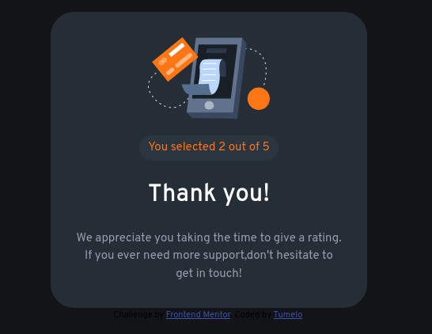

# Frontend Mentor - Interactive rating component solution

This is a solution to the [Interactive rating component challenge on Frontend Mentor](https://www.frontendmentor.io/challenges/interactive-rating-component-koxpeBUmI). Frontend Mentor challenges help you improve your coding skills by building realistic projects. 

## Table of contents

- [Overview](#overview)
  - [Screenshot](#screenshot)
  - [Links](#links)
- [My process](#my-process)
  - [Built with](#built-with)
  - [What I learned](#what-i-learned)
  - [Continued development](#continued-development)
- [Author](#author)
- [Acknowledgments](#acknowledgments)


## Overview

### Screenshot





### Links

- Solution URL: [Add solution URL here](https://your-solution-url.com)


## My process

### Built with

- Semantic HTML5 markup
- CSS custom properties
- Flexbox

### What I learned

```html
<div class="rating">
  <button class="rate" id="one">1</button>
  <button class="rate" id="two">2</button>
  <button class="rate" id="three">3</button>
  <button class="rate" id="four">4</button>
  <button class="rate" id="five">5</button>
</div>
<button class="submit">submit</button>
```
```css
.container, .rating, .icon ,.ratingMessage {
  display: flex;
}

.container, .containerThank {
  gap: 1.3125rem;
  flex-direction: column;
  background-color: var(--clr-Dark-Blue); 
  width: 25rem;
  padding: 2rem;
  border-radius: 1.875rem;
}

.submit, .rate {
  cursor: pointer;
  transition: background-color .15s, color .15s;
}
```
```js
$('.rate').click( (el) => {
    let options = document.getElementsByClassName('rating')[0].children;

    for (let i = 0; i < options.length; i++)
    {
        if (options[i] == el.target)
        {
            rate = i + 1;
        }
        $(options[i]).css("background-color","var(--clr-Light-Blue)");
    }
    // el.target.style.background = 'var(--clr-Light-grey)';
    $(el.target).css("background-color","var(--clr-Light-grey)");
});
```

### Continued development

responsive web design, layout [focal point, white space and hierarchy] and advance javacript


## Author

- Website - [Tumelo](https://github.com/Tumelo4)
- Frontend Mentor - [@Tumelo4](https://www.frontendmentor.io/profile/Tumelo4)
- Twitter - [@tumelo108620031](https://www.twitter.com/tumelo108620031)


## Acknowledgments

Thanks to Frontend Mentor my skill will improve